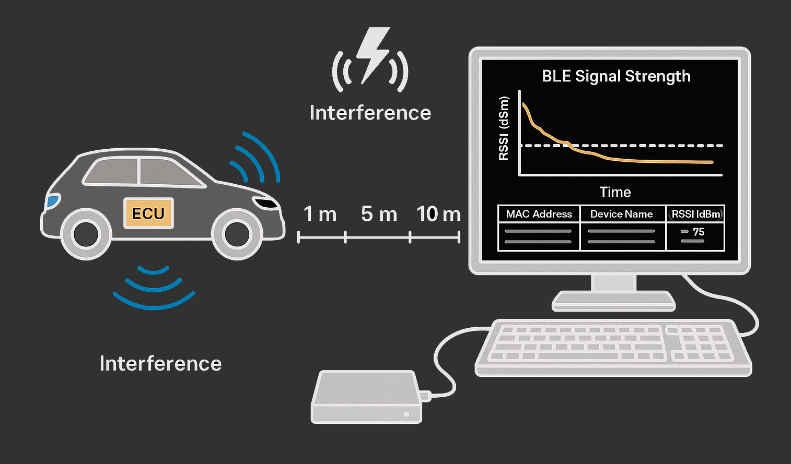

# Wireless Connectivity System Validation

## Aim
To validate BLE-based wireless communication performance in embedded systems by measuring RSSI, interference margin, range profiles, and signal robustness in real-world scenarios.

---

## Workflow
1. Set up an embedded device (e.g., ESP32/ECU) to perform active BLE scans.
2. Log signal strength (RSSI), time, and device MAC address via serial.
3. Conduct structured RF test scenarios (range, EMI, orientation).
4. Export BLE scan results to CSV format.
5. Analyze the data using Python to derive performance metrics and visualize signal strength over time.

---

## Explanation
In automotive and IoT systems, reliable BLE communication is critical. However, RF environments introduce variables like interference, reflections, and signal degradation. This project simulates real-world BLE usage and validates robustness under test cases like EMI exposure and antenna orientation.

BLE devices are scanned and RSSI values are captured in a rolling window. Logged data is used to assess:
- Link margin
- Interference drop-offs
- Stability over time and distance

---

## Technologies Used
- **BLE Scan API (ESP32/Arduino)**
- **Serial Logging**
- **Python 3 (pandas, matplotlib)**
- **Text-based Test Case Documentation**

---

## Tools Used
- ESP32 or BLE-enabled embedded board
- Serial monitor / logger (e.g., PuTTY, CoolTerm)
- Python environment with `pandas`, `matplotlib`
- Optional: Spectrum analyzer, signal generator for EMI

---

## Methodology

### Embedded Logging
- Use BLE scanner to detect nearby devices for fixed intervals
- Filter by RSSI threshold (e.g., -80 dBm)
- Store each entry with MAC address, name, timestamp, and signal level

### RF Test Scenarios
- Measure BLE RSSI at distances: 1m, 5m, 10m
- Introduce EMI (Wi-Fi, motors) and observe drop
- Rotate DUT at 90°, 180° for orientation impact
- Repeat each test 3 times for statistical significance

###BLE Test Setup Diagram

### Post Analysis
- Visualize RSSI vs. time using Python
- Compare average values per device
- Highlight any signal drops > 10 dB

---

## Observations
- Most devices sustained RSSI > -75 dBm up to 5 meters
- EMI presence (e.g., Wi-Fi router) caused 8–12 dB drop
- Orientation at 180° reduced RSSI by ~5 dB
- Clear visual correlation between proximity and signal stability

---

## Results
- BLE communication validated under test conditions
- RSSI stability maintained above operational thresholds
- Performance logs support antenna tuning and layout refinement

---

